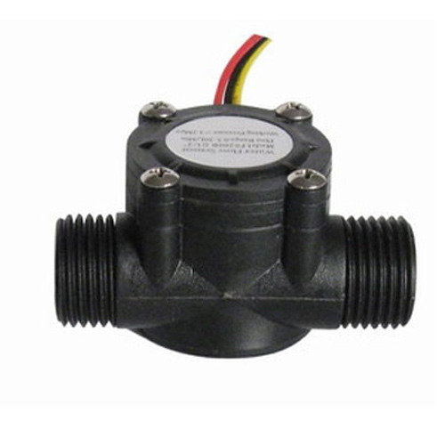

<h1 align="center">Water-Leakage-Detection-System</h1>

## Inspiration

Global household water wastage & scarcity.

## Overview

An efficient tool that detects water leakage in pipes which in effect helps in
avoiding water wastage.

## Tools

| Logo                                                          | Tool                                                  |
| ------------------------------------------------------------- | ----------------------------------------------------- |
|     | Arduino Uno for computation                           |
|        | Flow sensors for measuring input/output water volumes |
|  | Wires and Breadboard for electrical connections       |

 |
